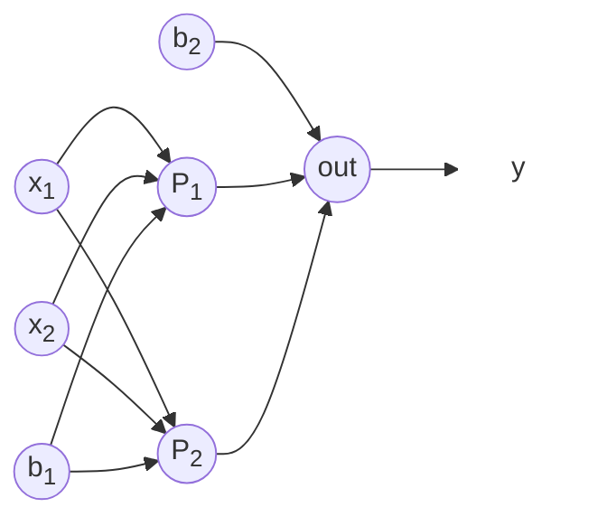

# One Perceptron Different Activations

$$y = \sigma(-4.79x_1 + 5.90x_2 - 0.93)$$

Where $\sigma$ is the activation function (sigmoid, hard limit, or RBF).

# Two-layer neural network Different Activations

$$y = W^T \sigma(V^T x + b_v) + b_w$$

With the given parameters:

$$V^T = \begin{bmatrix} -2.69 & -2.8 \\ -3.39 & -4.56 \end{bmatrix}$$

$$b_v = \begin{bmatrix} -2.21 \\ 4.76 \end{bmatrix}$$

$$W = \begin{bmatrix} -4.91 \\ 4.95 \end{bmatrix}$$

$$b_w = -2.28$$

Where $\sigma$ is applied element-wise to its input vector.

# Activation Functions

1. Sigmoid function:
   $$\sigma(z) = \frac{1}{1 + e^{-z}}$$

2. Hard limit function:
   $$\sigma(z) = \begin{cases} 1 & \text{if } z \geq 0 \\ -1 & \text{if } z < 0 \end{cases}$$

3. Radial basis function:
    $$\sigma(z) = \exp(-\beta z^2)$$
    Where $z$ is the weighted sum of inputs (i.e., $z = y$).

## Radial Basis Function (RBF) Definition

A Radial Basis Function (RBF) is a real-valued function whose value depends only on the distance from the origin or some other center point. The radial basis function is typically defined as a Gaussian function:

$$\phi(x) = \exp(-\beta \|x - c\|^2)$$

Where:
- $x$ is the input vector
- $c$ is the center of the RBF
- $\beta$ is a shape parameter controlling the width of the function
- $\|x - c\|$ is the Euclidean distance between $x$ and $c$

[Read more here](https://www.simplilearn.com/tutorials/machine-learning-tutorial/what-are-radial-basis-functions-neural-networks)
